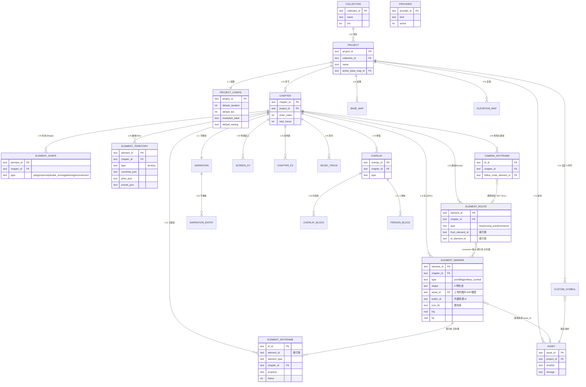

# MapVideo 数据模型分析与数据库重设计

> 从「单列 JSON 文档存储」到「规范化关系模型」——元素继承、关联多重性、主外键与迁移方案。

- **版本**：V1 → V2
- **引擎**：SQLite（`node:sqlite`，桌面端）/ Dexie（网页端）
- **规模**：23 张表 · 3 视图 · 6 触发器（DDL 已实测执行）
- **配套**：`docs/db-schema-v2.sql`（DDL 事实源）、`docs/db-tables.md`（表清单与字段字典）、`docs/db-er-diagram.mmd`（E-R 图源）

## 2026-09-10 改版：元素表按工具栏聚合为 4 张类别宽表

本文档记录的是 V2 的第一版设计；正文保留其推演过程（字段与关系的来源分析仍然有效），但**当前结构以 `docs/db-schema-v2.sql` 与 [`docs/db-tables.md`](db-tables.md) 为准**。改版要点：

- **取消 element 基表与 13 张子表**，改为 4 张类别宽表（表内用 `type` 判别子类型）：`element_marker`（标记）· `element_route`（路线）· `element_shape`（形状）· `element_territory`（疆域）；
- **point 视觉形态扩展为 9 种**（新增 图片 / GIF / 模型 / 图标库）：`element_marker.shape` 扩容，媒体资源走 `asset_id`（用户上传）或 `builtin_id`（内置打包、不入库），能力矩阵由 CHECK 与属性面板共同约束（2026-09-11 起动图 / 模型 / 图标均已放开着色）；`asset.kind` 增 `gif` / `model` 与 `meta_json`（包围盒/帧数，免下载预览），`custom_symbol` 增 `ns` 命名空间以支持自建图标库；
- **图片类下线**：`custom_icon` 元素类型与 Image 工具被移除；
- **疆域内部实体 JSON 内联**：原 4 张 `territory_*` 表并入 `element_territory` 的 `countries_json` / `plots_json` / `events_json`；
- **标签内联**为各元素表的 `label_json`；**关键帧改弱引用**（`element_id` 无外键，改由清理触发器与自检视图兜底）；
- 规模：**23 张表 / 3 视图 / 6 触发器**（原 37 / 5 / 17）；跨类别列表改用视图 `v_element_index`。

## 结论摘要

当前系统（V1）的数据库只有两张表：`projects(id, name, data, size, updated_at)` 与 `providers`。整个项目——章节、13 类地图元素、相机、弹窗、字幕、配乐、疆域、素材——全部序列化进 `data` 这一个 TEXT 列。数据库层对「继承」「关联」「多重性」**零表达**：这些语义只存在于 TypeScript 的判别联合与运行时代码里，数据库无法保护它们。

V2 把这些语义下沉到数据库：**继承**用「按工具栏聚合的类别宽表」（4 张表，表内 `type` 判别子类型；改版前为 CTI：1 基表 + 13 子表）；**关联**用主外键 + 复合外键表达；**多重性**用 1:N / 1:1 / N:M 的表结构与唯一索引固化；**生命周期**用 `CASCADE / SET NULL / RESTRICT` 三档策略区分。同时把 base64 素材从 JSON 中剥离进 `asset` 表——这是收益最大的一项改造。

**对外契约不变**：项目导入导出仍走 `ProjectExport`（V1 结构），存储范式升级不改变传输格式。

## 一、页面元素清单与关系梳理

### 1.1 三层结构

编辑页面上的全部可视与可交互对象，收敛为三个层次。`Project` 是聚合根，`Chapter` 是时间与生命周期的边界，`MapElement` 是真正被绘制的内容。

| 层次 | 实体 | 说明 | 数量级 |
|---|---|---|---|
| 聚合根 | `MapVideoProject` | 全局配置、底图/高程图目录、自定义符号、章节目录 | 1 |
| 章节层 | `Chapter` | 标题/时间跨度/相机/元素/弹窗/特效/字幕/配乐，以及可覆盖的底图 | 1 – 数十 |
| 内容层 | `MapElement`（13 子类） | 地图上绘制的一切：点、线、面、箭头、军标、旗、连接线、疆域 | 每章 0 – 数百 |
| 叠加层 | `OverlayItem`（11 类型） | 屏幕空间弹窗：图表、人物卡、战报、时间线、引用、对比、计数、对话、地点、自定义块 | 每章 0 – 数十 |
| 时间层 | `CameraKeyframe` / `ScreenFxItem` / `ChapterEffect` / `NarrationTrack` / `MusicTrack` | 镜头、天气与画面特效、章特效、字幕、配乐 | 每章 0 – 数十 |
| 资源层 | `BaseMapConfig` / `ElevationMapConfig` / `CustomSymbol` | 底图、地形、自定义图标，项目级共享 | 各 0 – 数十 |
| 配置层 | `ProviderConfig` | LLM / TTS 连接配置，**独立聚合**，不属于项目内容 | 0 – 数十 |

### 1.2 继承结构：一个判别联合（改版后按工具栏聚合为 4 张类别表）

`MapElementBase` 提供公共字段（`id`、`type`、`name`、`visible`、`locked`、`startFrame`、`endFrame`、`style`、`zIndex`、`shapeCategory`、`animEffect`、`flyMode`、`showIcon`、`moveIcon` 与移动时间语义），13 个具体类型通过 `type` 判别字段「特化」出各自的几何与样式字段。

#### 子类字段量级差异极大——这是选型的关键依据

| type | 专有字段数 | 几何载体 | 备注 |
|---|---|---|---|
| `flag` | 6 | `coordinates` | 最简单：文字 + 颜色 + 尺寸 |
| `encirclement` / `gathering` | 4 / 5 | `center` + `radius` | 纯标量 |
| `point` | 10 | `coordinates` | 5 种形态 × 朝向 × 缩放 |
| `custom_icon` / `military_symbol` | 6 / 5 | `coordinates` | 引用 `CustomSymbol` / `sidc` |
| `moving_point` / `double_arrow` | 4 / 3 | `path` / `points` | 含关键帧曲线 |
| `line` | 13 | `coordinates[]` | 含路线特效、流动、战线梳齿 |
| `arrow` | 9 | `from` / `to` / `path` | 8 种箭头形态 |
| `polygon` | 19 | `coordinates[][]` | 4 种形状 + 形变关键帧 + 防御圈 |
| `connector` | 6 | **无**（引用两个元素） | **唯一引用其它元素的类型** |
| `territory` | 4 组子实体 | `plots[].rings` | 内部还有势力 / 地块 / 兼并事件三张子表 |

字段数从 3 到 19 不等，且 `territory` 是组合结构。这个离散度直接否决了「单表继承」，详见 3.3。

### 1.3 关联关系与多重性总表

元素之间以及元素与资源之间的关联共 **34 条**。按语义分三类：**组合**（子对象随父消亡，生命周期绑定）、**关联**（引用一个独立存在的对象）、**继承**（1:1 具化）。

| # | 关联 | 方向 | 多重性 | 类别 |
|---|---|---|---|---|
| 1 | Project → Chapter | 1 → N | 一章属唯一项目 | 组合 |
| 2 | Project → BaseMap / ElevationMap / CustomSymbol | 1 → N | 资源项目级共享 | 组合 |
| 3 | Project → activeBaseMapId / activeElevationMapId | N → 1 | 可空引用 | 关联 |
| 4 | Chapter → Element | 1 → N | 元素不跨章节 | 组合 |
| 5 | Chapter → CameraKeyframe | 1 → N | 至少 1 个初始视角 | 组合 |
| 6 | Chapter → Overlay / ScreenFx / ChapterEffect / MusicTrack | 1 → N | 可为空集合 | 组合 |
| 7 | Chapter → NarrationTrack | 1 → 1 | 恒存在（可空内容） | 组合 |
| 8 | NarrationTrack → NarrationEntry | 1 → N | 字幕条顺序排列 | 组合 |
| 9 | Chapter → BaseMap / ElevationMap | N → 1 | 可空，覆盖项目默认 | 关联 |
| 10 | Element → 13 个子类 | 1 → 1 | **恰好一个**具化 | 继承 |
| 11 | Element → ElementLabel | 1 → 0..1 | 仅 point / line 有 | 组合 |
| 12 | Element → ElementKeyframe | 1 → N | opacity/scale/rotation/progress | 组合 |
| 13 | `connector.fromElementId` → Element | N → 1 | 一个元素可被多条线引用 | 关联 |
| 14 | `connector.toElementId` → Element | N → 1 | 同上，两列独立外键 | 关联 |
| 15 | `cameraKeyframe.followRoute.routeElementId` → Element | N → 1 | 可空；**须同章节** | 关联 |
| 16 | `customIcon.symbolId` → CustomSymbol | N → 1 | 必填 | 关联 |
| 17 | `element.moveIcon.symbolId` → CustomSymbol | N → 1 | 弱引用，藏在 `moveIcon` 内 | 弱关联 |
| 18 | TerritoryElement → TerritoryCountry | 1 → N | 势力列表 | 组合 |
| 19 | TerritoryElement → TerritoryPlot | 1 → N | 地块列表 | 组合 |
| 20 | TerritoryElement → TerritoryEvent | 1 → N | 按 frame 升序 | 组合 |
| 21 | `plot.ownerId` → TerritoryCountry | N → 1 | **须同疆域** | 关联 |
| 22 | `event.toCountryId` → TerritoryCountry | N → 1 | **须同疆域** | 关联 |
| 23 | TerritoryEvent ↔ TerritoryPlot（`plotIds[]`） | N ↔ M | 一次兼并吞并多块 | 关联 |
| 24 | Overlay → OverlayBlock | 1 → N | custom 类型的内容块 | 组合 |
| 25 | Overlay → PersonBlock | 1 → N | person 类型的 5 类槽位 | 组合 |
| 26 | `overlay.content.children[]` → OverlayItem | N → 1 | 旧 group 自引用，已废弃 | 遗留 |
| 27 | Overlay（person/custom）→ 音频资产 | N → 1 | 可空 | 关联 |
| 28 | 各实体 → 图片 / 音频 / 视频（dataURL 或 URL） | N → 1 | **当前为无约束的裸字符串** | 弱关联 |
| 29 | ProviderConfig | — | 独立聚合，无外键 | 孤立 |

### 1.4 依赖方向

依赖方向是单向的，且**引用方向与删除级联方向相反**：

- **数据引用方向：子 → 父。**外键永远写在「依赖方」（`element.chapterId`、`connector.fromElementId`、`plot.ownerId`），被引用方不持有反向指针。

- **删除级联方向：父 → 子。**删除父实体时沿外键反向传播。`chapter` 不知道自己有哪些 `element`，但删它时必须清理干净——这正是需要数据库级联的原因。

- **元素间依赖是「点状」的，不是树。**只有 `connector` 与 `cameraKeyframe.followRoute` 引用其它元素，其余 11 类元素彼此独立。因此依赖图是「一个浅层 DAG + 大量孤立节点」，不存在深递归删除。

- **代码层依赖：**`types → lib → stores → components → compositions` 严格单向（与数据层方向一致，这是好设计，V2 不改变）。

### 1.5 引用完整性缺口（V1 的实际缺陷）

由于引用只存在于内存对象图中，数据库不提供任何保护，代码里也没有清理逻辑。`projectStore.deleteElement` 的实现是**裸数组过滤**：

```ts
// src/stores/projectStore.ts:394 — 只删自己，不清理任何引用方
deleteElement: (chapterId, elementId) => {
  const chapters = state.project.chapters.map((ch) =>
    ch.id === chapterId
      ? { ...ch, elements: ch.elements.filter((el) => el.id !== elementId) }
      : ch
  );
  // ← 指向该元素的 connector、跟随该元素的相机关键帧，全都没动
}
```

| 缺口 | 触发路径 | 后果 | V2 修复 |
|---|---|---|---|
| **G1** 连接线悬空 | 删除被 `connector` 引用的元素 | 渲染时 `elements.find()` 返回 `undefined`，连线段静默消失或报错 | CASCADE复合外键 + 反向清理触发器 |
| **G2** 跟随机位悬空 | 删除被 `followRoute` 跟随的路线元素 | 相机跟随目标丢失，视角可能停在上一位置 | SET NULL退化为固定视角 |
| **G3** 符号静默损坏 | 删除仍被元素使用的 `CustomSymbol` | 图标渲染为空（`registry.find()` 未命中），用户不知原因 | RESTRICT + UI 提示引用数 |
| **G4** 地块归属无约束 | `plot.ownerId` 指向不存在或跨疆域的势力 | 地块无颜色 / 归属错乱 | 复合外键`(element_id, owner_id)` |
| **G5** 无同章节约束 | 手动构造或数据损坏导致跨章节引用 | 跨章节引用在渲染端不可见，成为「幽灵依赖」 | 复合外键（connector）+ 触发器（camera） |
| **G6** 类型切换残留 | `PropertiesPanel` 原地改 `type`（如 pin → custom_icon） | 旧类型字段残留，`map-renderer` 需靠签名表重建图层兜底（AGENTS.md §6.2 已记录此坑） | 事务化三步切换 + 一致性自检视图 |

## 二、现状数据库评估

### 2.1 V1 实现

#### 桌面端（SQLite）

引擎：Electron 内置 `node:sqlite`，`DatabaseSync`，零原生模块。

文件：`%APPDATA%/map-video/mapvideo.db`

**projects**：`id` PK、`name`、`data` TEXT（**整个项目 JSON**）、`size`、`updated_at`

**providers**：AI/TTS 配置，11 列，已是规范化的。

建表位置：`electron/main.mjs → initDb()`

#### 网页端（Dexie / IndexedDB）

库名 `MapVideoDB`，v1，单表 `projects`，索引 `id, name, createdAt, updatedAt`。

同样存储完整项目 JSON，结构与桌面端 `data` 列一致。

Provider 配置存 `localStorage`。

跨端迁移靠 `ProjectExport` JSON 导入导出。

### 2.2 问题清单

| # | 问题 | 严重度 | 影响面 |
|---|---|---|---|
| P1 | **继承关系在库层完全缺失**：13 个子类的字段全在 JSON 里，无 NOT NULL / CHECK 保护。例如 `line_width` 缺失或为字符串也照存不误，错误推迟到渲染时才暴露 | 高 | 正确性 |
| P2 | **关联关系零约束**：无外键，G1–G5 五类悬空引用无法防止 | 高 | 正确性 |
| P3 | **base64 素材内嵌 JSON**：图片/音频以 dataURL 存在 `iconUrl` / `imageUrl` / `audioUrl` / `url` 里，单张图可让项目 JSON 膨胀数 MB。IndexedDB 单条记录随之膨胀，SQLite 单行写入放大 | 高 | 性能 / 可用性 |
| P4 | **保存是 O(项目大小) 的全量重写**：每次保存 `JSON.stringify` 整个项目；脏标记比对（`isProjectDirty`）也是全量字符串比较。改一个字也要重写整库 | 中 | 性能 |
| P5 | **无法按条件查询**：想找「某章节内所有 arrow」或「引用了已删符号的元素」，只能全量解析 JSON 后内存过滤 | 中 | 可维护性 |
| P6 | **结构演进靠 6 条手工迁移链**：`normalizeOverlayContent` / `normalizePersonContent` / `normalizeTitleStyle` / `normalizeNarrationTrack` / `normalizeTerritoryDisplay` / `normalizeChapters` 在 load/import 时逐字段兜底，无版本号，无法判断数据「已迁移到哪一版」 | 中 | 可维护性 |
| P7 | **循环外键与可选引用混杂**：`activeBaseMapId`、`chapter.baseMapId`、`followRoute.routeElementId` 等引用在 JSON 里只是字符串，删掉目标后毫无察觉 | 中 | 正确性 |

#### V1 并非没有优点

文档存储让「新增元素类型」零迁移成本，`ProjectExport` 天然自描述，跨端迁移简单。V2 **在传输层完整保留这一优点**（导出仍是 V1 JSON），只在存储层做规范化。这是本次设计刻意维持的边界。

## 三、V2 关系模型设计

### 3.1 归一化策略：哪些列化、哪些留 JSON

全量规范化会把 100+ 个样式标量炸成 100+ 张表；全量 JSON 就等于现状。因此先定一条可复用的判定规则，再逐字段归类：

| 级别 | 判定标准 | 处理方式 | 典型字段 |
|---|---|---|---|
| **P1**必须列化 | 身份、时间轴、以及构成引用图的字段——约束与查询都依赖它们 | 独立列 + 主键/外键/CHECK | `id`, `start_frame`, `end_frame`, `chapter_id`, `from_element_id` |
| **P2**独立成表 | 子结构自身有 id 或顺序语义，且需要被单独约束或寻址 | 1:N 子表 | `element_keyframe`, `overlay_block`, `person_block`, `territory_*`, `narration_entry` |
| **P3**保留 JSON | 固定形状、整体读写、不参与约束与检索的配置块 | JSON 列 + `json_valid()` 约束 | `display_json`, `front_style_json`, `route_effect_json`, `bg_json`, `person_layout_json`, `move_icon_json` |
| **P4**外置存储 | 大体积二进制内容 | 独立 `asset` 表 + 文件/blob，业务表只存 `asset_id` | 图片、音频、视频、字体 |

注：`chart.data` / `timeline.items` / `dialogue.items` 虽是数组，但不被单独寻址、无逐项约束，按 P3 留在 `payload_json`；而关键帧虽也是数组，却带 `(element_id, property, frame)` 唯一性与时间轴语义，按 P2 建表。

### 3.2 实体清单（23 张表，按结构分 10 组）

本节按**存储结构**分组（便于对照 DDL）。**改版后元素表按工具栏聚合为 4 张类别宽表**（标记 / 路线 / 形状 / 疆域，图片类已下线），若想按工具栏视角看这 23 张表与各自的工具入口，见 [`docs/db-tables.md`](db-tables.md) 第三节与第五节。

E-R 图（源文件 `docs/db-er-diagram.mmd`，下方为同内容，Markdown 渲染器可直接显示）：



> 注：下表是改版前的 37 表版本，元素部分已由 4 张类别宽表取代；现行完整清单见 [`docs/db-tables.md`](db-tables.md) 第三节。

| 组 | 表 | 说明 |
|---|---|---|
| 聚合根 | `project` | 项目本体：身份 / 归属 / 审计字段 + 当前生效的底图与高程图 |
| 项目配置 | `project_config` | GlobalConfig（默认时长 / 帧率 / 分辨率 / 缓动 / 投影）；与 project 1:1，配置面板只读写这张表 |
| 资源素材 | `base_map`, `elevation_map`, `custom_symbol`, `asset` | `asset` 为新增，承担 P4 外置存储 |
| 章节与时间 | `chapter`, `camera_keyframe`, `chapter_fx`, `screen_fx`, `narration`, `narration_entry`, `music_track` | 7 张，覆盖章节的 7 类子集合 |
| 元素（CTI 父表） | `element` | 基类字段 + 判别列 `type` |
| 元素（CTI 子表） | `element_point`, `element_moving_point`, `element_line`, `element_polygon`, `element_arrow`, `element_double_arrow`, `element_encirclement`, `element_gathering`, `element_military_symbol`, `element_connector`, `element_custom_icon`, `element_flag`, `element_territory` | 13 张，主键即外键，与 `type` 取值一一对应 |
| 元素附属 | `element_label`, `element_keyframe` | 标签（point/line 共用 1:1）；动画关键帧（统一 8 种 property） |
| 疆域内部 | `territory_country`, `territory_plot`, `territory_event`, `territory_event_plot` | 3 实体 + 1 张 N:M 联结表 |
| 叠加层 | `overlay`, `overlay_block`, `person_block` | overlay 承载 10 类弹窗，仅 custom/person 需要子表 |
| 配置 | `provider` | 独立聚合；新增「每 kind 至多一条 active」的部分唯一索引 |

### 3.3 继承映射选型

对象继承映射到关系表有三种经典方案。这里逐一对本项目做评估：

| 方案 | 结构 | 优点 | 对本项目的致命问题 | 结论 |
|---|---|---|---|---|
| **单表继承**STI | 一张 `element`，包含全部子类列（大量可空） | 零 JOIN，读取最简单，改动最小 | 13 类字段合计 60+ 列，大面积 NULL；**无法表达子类必填规则**——例如「`shapeKind='circle'` 时 `circleMeta` 必填」「`arrow` 必须有 `arrowType`」，这些约束全部退化回应用层，等于把 JSON 的问题搬进列里 | 否决 |
| **类表继承**CTI | `element` 基表 + 13 张子表，主键共享 | 基类与子类字段**各自可强约束**；与 TS 判别联合 1:1 对齐；新增类型只加一张表，不动旧表（开闭原则） | 读一章需多路 JOIN；写入需事务双写；**子表级联删除会留下孤儿基类行**（已用触发器解决，见 3.6） | 选用 |
| **具体表继承** | 13 张完全独立的表，无基表 | 无 NULL，各表最紧凑 | 「本章全部元素」要 UNION 13 次；`visible`/`z_index`/`start_frame` 等公共字段重复 13 份，且无法对其做统一索引与排序。**与编辑器「同构数组 + 按 type 分派」的心智完全不符**，元素列表、层级渲染、选中态都要改写 | 否决 |

#### 选型依据：为什么 CTI 值得付出 JOIN 成本

- **字段离散度决定了 STI 不可行。**子类专有字段从 3 个（`flag`）到 19 个（`polygon`），且 `territory` 是组合结构。STI 会产生 60+ 列，其中多数行 80% 为 NULL。

- **约束表达力是核心收益。**DDL 里真实写下的这些规则，在 V1 中全部不存在：

  ```sql
  -- element_shape：形状参数与形状种类联动
  CHECK (shape_kind IS NOT 'circle' OR circle_meta_json IS NOT NULL)
  -- element_route：禁止自环
  CHECK (from_element_id <> to_element_id)
  -- element_marker：emoji 形态必须有字符
  CHECK (shape IS NOT 'emoji' OR emoji IS NOT NULL)
  ```

- **JOIN 成本在本项目可忽略。**单用户本地 SQLite，单章节元素数为数十到数百。且读路径可以分层：元素列表/时间线轨道**只查基表**（`name`/`visible`/`z_index`/时间足够渲染），渲染时才按已知的 `type` 取对应子表——不产生 13 路 JOIN。必要时用视图（`v_element_point` 等）固化常用组合。

- **与代码同构，认知成本最低。**13 张子表与 `src/types/index.ts` 的 13 个 interface 严格一一对应，改 TS 类型时改哪张表无需思考。

### 3.4 关键表字段定义

#### element —— CTI 基表

| 列 | 类型 | 约束 | 来源字段 |
|---|---|---|---|
| `element_id` | TEXT | **PK** | id |
| `chapter_id` | TEXT | **FK** → chapter CASCADE | （外层章节） |
| `type` | TEXT | **CHECK** 13 取值 | type（判别列） |
| `name` / `visible` / `locked` | TEXT / INT | CHECK 0/1 | 同名 |
| `start_frame` / `end_frame` | INTEGER | NOT NULL, CHECK 顺序 | 同名（绝对帧） |
| `z_index` / `shape_category` / `anim_effect` / `fly_mode`/ `show_icon` | INT / TEXT | CHECK 枚举 | 同名 |
| `move_icon_json` | TEXT | P3 JSON | moveIcon（固定形状配置块） |
| `move_start_frame` / `move_end_frame` / `uniform_move` / `point_times_json` | INT / TEXT | CHECK 顺序 | 同名 |
| `style`（opacity/scale/rotation） | — | **拆至** `element_keyframe` | ElementStyle |

唯一索引 `ux_element_chapter_id(chapter_id, element_id)` 专为 `element_connector` 的复合外键提供父侧唯一键。

#### element_connector —— 唯一的跨元素引用，复合外键示范

> 下列片段属于**改版前的 CTI 设计**，保留以说明「复合外键如何表达同章节约束」的推演过程；现行结构见 `docs/db-schema-v2.sql`。

```sql
CREATE TABLE element_connector (
  element_id TEXT PRIMARY KEY REFERENCES element(element_id) ON DELETE CASCADE,
  -- 冗余列：仅为承载下方复合外键，保证 from/to 与本连接线同属一个章节
  chapter_id TEXT NOT NULL,
  from_element_id TEXT NOT NULL,
  to_element_id TEXT NOT NULL,
  line_width REAL NOT NULL DEFAULT 2,
  line_color TEXT NOT NULL DEFAULT '#FFFFFF',
  line_dash_json TEXT,
  animated INTEGER NOT NULL DEFAULT 0 CHECK (animated IN (0,1)),
  arrowhead INTEGER NOT NULL DEFAULT 0 CHECK (arrowhead IN (0,1)),
  CHECK (from_element_id <> to_element_id),
  FOREIGN KEY (chapter_id, from_element_id) REFERENCES element(chapter_id, element_id) ON DELETE CASCADE,
  FOREIGN KEY (chapter_id, to_element_id)   REFERENCES element(chapter_id, element_id) ON DELETE CASCADE
);
```

这两条复合外键一次性解决 G1（悬空）与 G5（跨章节）：端点被删时连接线自动消失，且无法引用其它章节的元素。

#### element_keyframe —— 8 种动画曲线统一成一张表

```sql
CREATE TABLE element_keyframe (
  kf_id TEXT PRIMARY KEY,
  element_id TEXT NOT NULL REFERENCES element(element_id) ON DELETE CASCADE,
  property TEXT NOT NULL CHECK (property IN (
    'opacity','scale','rotation','draw_progress','progress',
    'path_progress','fill_progress','morph')),
  frame INTEGER NOT NULL CHECK (frame >= 0),
  easing TEXT,
  value_num REAL,        -- 标量快路径
  value_json TEXT,       -- morph 用（rings 数组）
  CHECK (value_num IS NOT NULL OR value_json IS NOT NULL),
  UNIQUE (element_id, property, frame)
);
```

V1 中 `ElementStyle.opacity`、`LineElement.drawProgress`、`ArrowElement.progress`、`MovingPointElement.pathProgress`、`PolygonElement.fillProgress`、`morphKeyframes` 是 6 组独立数组；V2 统一为 `property` 区分的一张表，`(element_id, property, frame)` 唯一索引防止同一帧重复定义。

### 3.5 引用完整性策略

引用边的删除行为分三档，依据是「被引用对象的消失是否让引用失去意义」：

| 引用边 | 基数 | ON DELETE | 依据 |
|---|---|---|---|
| `element` → `chapter` | N:1 | **CASCADE** | 章节是元素的生命周期边界 |
| 13 张元素子表 → `element` | 1:1 | **CASCADE** | 具化行不能脱离基类存活 |
| `element_keyframe` / `element_label` → `element` | N:1 / 1:1 | **CASCADE** | 动画曲线与标签是附着物，无独立身份 |
| `element_connector` → `element`（from / to） | N:1 ×2 | **CASCADE** + 触发器 | 端点消失则连接线无意义。修复 G1 |
| `camera_keyframe.follow_route_element_id` → `element` | N:1 | **SET NULL** | 路线被删时视角退化为固定镜头。修复 G2 |
| `element_custom_icon.symbol_id` → `custom_symbol` | N:1 | **RESTRICT** | 符号仍被占用则拒绝删除，UI 先提示引用数。修复 G3 |
| `territory_plot.owner_id` → `territory_country` | N:1 | **CASCADE**（复合外键） | 地块只能归属本元素内的势力。修复 G4 |
| `territory_event.to_country_id` → `territory_country` | N:1 | **CASCADE**（复合外键） | 同上，兼并目标须同域 |
| `territory_event_plot` → event / plot | N:M | **CASCADE** | 纯联结表 |
| `overlay_block` / `person_block` → `overlay` | N:1 | **CASCADE** | 内容块随弹窗消亡 |

#### 一个必须记录的坑：复合外键 + SET NULL 不可用

直觉上 `camera_keyframe` 应该用复合外键 `(chapter_id, follow_route_element_id) → element(chapter_id, element_id)` 来同时保证「同章节」与「删路线置空」。**但 SQLite 在复合外键触发 SET NULL 时会把全部引用列置为 NULL——包括 `chapter_id`，而它是 NOT NULL，操作直接失败。**

因此采取二分策略：

- 能配合 **CASCADE** 的同章节约束 → 用**复合外键**（`element_connector`、`territory_*`）。

- 必须 **SET NULL** 的同章节约束 → 退回**单列外键 + BEFORE INSERT/UPDATE 触发器**（`camera_keyframe`）。

### 3.6 约束与触发器

DDL 共定义 **17 个触发器**，分三类：

| 类 | 数量 | 作用 |
|---|---|---|
| 子表 ↔ 判别列一致性 | 13 | `BEFORE INSERT` 于每张子表，校验 `element.type` 与之匹配。用 `IS NOT` 而非 `<>` 以正确处理 NULL |
| 冗余列一致性 | 1 | `element_connector.chapter_id` 必须与所属元素一致 |
| 同章节校验 | 2 | `camera_keyframe` 的 INSERT / UPDATE 路径，校验 `follow_route_element_id` 属于同章节 |
| CTI 反向清理 | 1 | 见下方说明 |

#### 设计过程中实测发现的 CTI 结构性缺陷（已修复）

把「删端点自动删连接线」写成复合外键 CASCADE 后，实测出现孤儿：删掉端点 B 后，`element_connector` 的具化行被级联删除，**但 `element` 里的连接线基类行还在**——形成「有 element 行却无任何具化行」的非法状态，破坏 CTI 的核心不变式。

根因：**CTI 中删除子表行不会向上删除父表行**，而跨实体级联只会命中子表。

修复：增加一个反向清理触发器——

```sql
CREATE TRIGGER trg_connector_base_cleanup
AFTER DELETE ON element_connector
BEGIN
  DELETE FROM element WHERE element_id = OLD.element_id;
END;
```

用 `AFTER DELETE` 而非 `BEFORE`：级联已删掉具化行，此时再清基类行；若用户直接删除连接线（基类行正在被删），该 DELETE 命中 0 行，且 `recursive_triggers` 默认关闭不会递归。两条路径均已实测无死循环。

### 3.7 一致性自检

提供 5 个诊断视图，迁移后与老库体检时运行，均**应返回 0 行**：

| 视图 | 检出 |
|---|---|
| `v_check_subtype_mismatch` | 存在具化行但判别列已变更（类型切换中断的残留） |
| `v_check_subtype_missing` | 判别列声称有具化但子表无行 |
| `v_check_dangling` | 悬空引用：connector 端点、camera 跟随目标、自定义图标符号、地块归属 |
| `v_element_point` / `v_element_line` | 常用「基表 + 具化」读取视图 |

## 四、设计依据汇总

| 设计决策 | 依据 |
|---|---|
| 13 个子类各建一张表（CTI） | 字段数 3–19 且离散度大；STI 会产生 60+ 可空列并丧失子类必填约束；具体表继承会破坏「同构数组」心智 |
| `element_keyframe` 单表承载 8 种 property | 6 组关键帧数组结构同构（frame + value + easing），唯一索引可统一施加；避免为每种类型建表 |
| `element_label` 独立成表而非在 point/line 重复列 | 标签是可选 1:1 值对象，仅 2 类元素使用；重复列会让「标签逻辑」散落两处 |
| GlobalConfig 独立成 `project_config` | 配置与项目本体职责分离：`project` 只留身份 / 归属 / 审计字段，配置面板只读写配置表；将来新增配置项不改动 `project` 结构 |
| `asset` 表承担 P4 外置 | base64 内嵌是当前最大的性能问题；内容寻址（sha256）顺带获得同图去重 |
| 复合外键用于「同域/同章节」约束 | 把「只能引用同一集合内对象」这条业务规则下沉为结构约束，无需应用层校验 |
| 样式标量走 P3 JSON | 固定形状、整体读写、不参与检索；列化它们会产生 100+ 张无意义的表 |
| `provider` 加部分唯一索引 | 「每 kind 至多一条 active」从应用层两步写（先全清后置位）升级为数据库保证 |
| 布尔统一 INTEGER 0/1 + CHECK | SQLite 无布尔类型，显式 CHECK 防止写入 `'true'`/`2` 之类的脏值 |
| 所有 JSON 列加 `json_valid()` | 保留 P3 灵活性的同时，至少保证「是合法 JSON」，避免半截字符串入库 |

## 五、改动说明

### 5.1 V1 → V2 迁移步骤

- **备份。**把 `projects` 重命名为 `projects_v1_backup`（保留 `data` 列作回滚快照），新建 V2 表结构。

- **读取。**对每个 V1 项目行解析 `data` JSON，先过一遍现有 6 条 `normalize*` 迁移链——**这一步必须保留**，因为老存档可能仍是 v1 结构（旧 person / 旧 overlay / 旧 titleStyle）。

- **按依赖序写入（单事务）。**顺序关键：`chapter` 必须先于元素行；`element_territory` 内的地块 / 事件 JSON 内联，无需额外顺序；`asset` 必须先于引用它的业务行。

  ```sql
  BEGIN IMMEDIATE;
    project → base_map / elevation_map / custom_symbol / asset
    → chapter → camera_keyframe
    → element_marker / element_route / element_shape / element_territory（按 type 分派）
    → element_keyframe
    → overlay → overlay_block / person_block
    → chapter_fx / screen_fx / narration / narration_entry / music_track
  COMMIT;
  ```

- **素材抽取。**扫描 `iconUrl` / `imageUrl` / `audioUrl` / `url` / `customSymbols[].url` 中的 dataURL：解码 → 算 sha256 → 写入 `asset`（按大小选 file 或 blob）→ 业务列改写为 `asset_id`。外链 URL 原样保留在 `url` 列，不进 asset 表。

- **校验。**运行 `v_check_subtype_mismatch` / `v_check_subtype_missing` / `v_check_dangling`，三者必须均返回 0 行，否则整事务回滚。

- **切换与保留。**启用 V2 读写路径，`projects_v1_backup` 保留一个版本周期后清理。

### 5.2 兼容策略：存储范式升级，传输契约不变

**这是本次设计最重要的边界约定。**

- **导出仍走 V1 结构。**`ProjectExport` 的 JSON 形状、字段名、`version` 号全部不变。规范化只发生在存储层，导出时把多表**重新组装**回判别联合数组。

- **导入仍接受 V1 JSON。**导入路径不改，写入时做一次「JSON → 多表」展开。

- **结果：**老存档可直接导入；导出的 json 在网页 Lite 端、旧版本客户端仍可用；跨端迁移零改动。这条边界让整个重构可以增量推进而不破坏任何现有用户数据。

### 5.3 代码改动清单

| 文件 | 改动 | 工作量 |
|---|---|---|
| `electron/main.mjs` | `initDb()` 换为 V2 DDL（含触发器/视图）；`db:projects:save\|get\|list` 三个 IPC 从「读写 JSON 列」改为「事务化多表读写」；新增 `db:projects:migrateV1` | 大 |
| `src/stores/db.ts` | Dexie schema 升级（见 5.4） | 中 |
| 新增 `src/lib/project-mapper.ts` | **建议新增。**承载双向映射：`rowsToProject()` / `projectToRows()`，把多表行组装回 `MapVideoProject`。这是 V2 的核心适配层，让上层 store 与组件**完全不感知**存储变化 | 中 |
| `src/stores/projectStore.ts` | 持久化调用改为走 mapper；`isProjectDirty` 可从「全量字符串比较」改为按实体版本号/时间戳比较 | 小 |
| `src/components/*` | **无需改动。**组件只消费 `project` 内存对象，不直接接触存储 | 无 |
| `src/lib/storage.ts` / `backend.ts` | 桌面端 IPC 接口签名不变，内部实现替换；新增素材上传/读取接口 | 小 |
| `README.md` | 「数据库设计」章节整体重写 | 小 |

### 5.4 网页端（Dexie）处理建议

Dexie 是 IndexedDB 封装，**不支持 JOIN，也不支持外键级联**。三个选项：

- **推荐：网页端维持文档型存储，但补结构化索引。**Dexie 升级到 v2，保留 `projects` 主表存完整 JSON（保证 Lite 端离线可用、零迁移风险），另建 `elements` 影子表（`id, projectId, chapterId, type`）用于「跨章节按类型查找」等查询需求。代价最小，且网页端本就是轻量形态。

- 全量多表化：把 V2 的 37 张表在 Dexie 里建 37 个 store。级联删除、复合外键全部改由应用层实现——**等于把 V2 在数据库层买到的一致性保障全部还回去**，不建议。

- 网页端也换 SQLite：引入 SQLite WASM（`sql.js` / `wa-sqlite`）+ 持久化到 OPFS。可两端共用完全相同的 DDL，但会显著增加 Lite 端体积与启动成本。

建议采用方案 1：**桌面端规范化（强一致），网页端文档型 + 影子索引（轻量）**；两者通过不变的 `ProjectExport` 契约互通。这是「按形态分配复杂度」的做法。

### 5.5 收益与代价

#### 收益

- **正确性：**6 类引用完整性缺口全部由数据库保证，不再依赖「记得清理」

- **性能：**素材外置后项目 JSON 从数 MB 降到数十 KB；保存从全量重写变为按实体增量

- **可查询：**「找所有引用了已删符号的元素」从内存全扫变为一条 SQL

- **可演进：**结构变更不再散落成无版本的手工迁移链，改由集中式的一次性升级脚本处理

- **可诊断：**3 个自检视图把「数据损坏」从隐性变为可检测

#### 代价

- **适配层复杂度：**需要 `project-mapper.ts` 承担双向映射，约数百行

- **写入需事务：**保存一个元素要写基表 + 子表（+ 可能的关键帧表），必须包在事务里

- **CTI 的固有陷阱：**子表级联留下孤儿基类行——已用触发器修复，但新增「跨实体级联」时需重复这个模式

- **两类存储范式并存：**桌面规范化、网页文档型，需在 mapper 层明确边界

- **老库迁移不可逆**（除却 `projects_v1_backup` 回滚）

## 六、验证结果

DDL 已用 Node 内置 `node:sqlite`（Node v22.22.2）在内存库中实际执行并跑完完整性用例：

- 22 表创建成功
- 3 视图
- 6 触发器
- 17/17 用例通过

| 用例 | 验证内容 | 结果 |
|---|---|---|
| 1 | marker 表按 `type` 承载 point / flag / military_symbol 三种子类型 | 通过 |
| 2 | shape / route / territory 三张类别表插入正常 | 通过 |
| 3 | CHECK：point 的 `shape='emoji'` 必须给 emoji | 通过 被拒 |
| 4 | CHECK：flag 必须给 `flag_text` | 通过 被拒 |
| 5 | CHECK：connector 端点不得自环 | 通过 被拒 |
| 6 | CHECK：connector 必须给两端 | 通过 被拒 |
| 7 | `element_keyframe` 弱引用插入正常 | 通过 |
| 8 | 删章节 → 元素与关键帧级联清理 | 通过 |
| 9 | **删元素 → 以它为端点的 connector 自动清理**（弱引用补偿触发器） | 通过 1 → 0 |
| 10 | 删元素 → 它名下的 keyframe 自动清理 | 通过 |
| 11 | 删连接线自身 → 无递归、无误删 | 通过 |
| 12 | 删被跟随的路线 → 跟随机位置空（FK SET NULL） | 通过 |
| 13 | follow 指向不存在 / 跨章节路线 → 被触发器拒绝 | 通过 被拒 |
| 14 | `v_check_territory_ref` 抓到「地块归属 / 兼并目标势力不存在」 | 通过 2 行 |
| 15 | `v_element_index` 汇总 4 类元素 | 通过 |
| 16 | `v_check_dangling` 在干净库上返回 0 行 | 通过 |
| 17 | `provider` 每 kind 至多一条 active | 通过 被拒 |

完整可执行 DDL：`docs/db-schema-v2.sql`（含分节注释、触发器与自检视图）。

## 七、未决问题

| # | 问题 | 说明 |
|---|---|---|
| Q1 | 是否需要为 `element_keyframe` 建「同一帧重复定义」的软校验 | 已有 `UNIQUE(element_id, property, frame)` 硬约束；但 V1 允许同帧多个关键帧（后者覆盖前者），迁移时可能撞唯一键，需在 mapper 里做去重策略 |
| Q2 | `chapter` 时间跨度的重叠约束 | 当前只加了 `ux_chapter_span(project_id, start_frame)`（起点不重复）。是否允许章节时间区间重叠需与产品确认，若不允许需改用触发器校验 |
| Q3 | 素材文件的生命周期与垃圾回收 | 元素被删后 `asset` 行仍在（无反向引用）。需要定期「孤儿素材清理」任务，或改用引用计数 |
| Q4 | `move_icon_json` 内的 `symbolId` 是弱引用 | P3 JSON 内的符号引用无法用外键约束。可选：把 `moveIcon` 提升为独立表以换取约束能力，但会为各类元素都增加一次 JOIN |
| Q5 | 撤销/重做（50 步历史栈）与数据库的关系 | 当前历史栈完全在内存（快照式）。V2 未改变这一点——数据库只承载「已保存」状态，这是有意的边界 |
| Q6 | 弱引用的一致性兜底策略（改版新增） | 取消 `element` 基表后，`connector` 端点与 `element_keyframe.element_id` 无法建外键，现由 4 条 AFTER DELETE 清理触发器 + `v_check_dangling` 兜底。**待定：是否在保存/导入后强制跑一次自检，非 0 行即回滚？** |
| Q7 | 疆域 JSON 内联后的一致性校验时机（改版新增） | `plot.ownerId` / `event.toCountryId` 的合法性由 `v_check_territory_ref` 校验（已用 json_each 实现）。待定：是否把它前置为写路径硬校验（保存前跑），避免脏数据入库 |
| Q8 | 图片类下线后 `custom_symbol` 的归属（改版新增） | `custom_icon` 元素类型与 Image 工具已移除，图标库（`custom_symbol`）目前只剩「上传入口 + asset 外置」。待确认：是否仍被其它类型引用（如点的自定义图片走的是 `asset_id` 而非 symbol）；若确认无人引用，可考虑一并下线上传入口 |

---

MapVideo 数据模型分析与数据库重设计 · 基于 `src/types/index.ts`、`src/stores/projectStore.ts`、`src/stores/db.ts`、`electron/main.mjs`、`README.md` 的实际代码梳理。

配套产物：`docs/db-schema-v2.sql`（已验证可执行）、`docs/db-tables.md`（表清单与字段字典）、`docs/db-er-diagram.mmd`（E-R 图源）。
